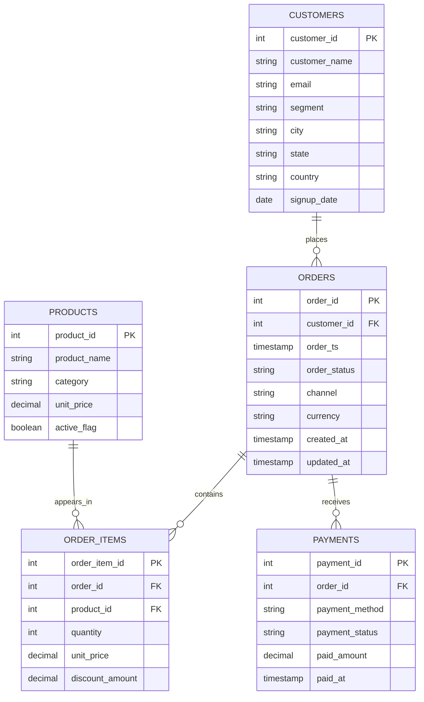

# Retail Warehouse ER Diagram

This diagram is the core model for the Phase 3 SQL labs.

## Teaching Notes

- `customers`, `products`, `orders`, `order_items`, and `payments` are normalized tables.
- `orders` depends on `customers`.
- `order_items` resolves the many-to-many relationship between `orders` and `products`.
- `payments` lets us compare operational order status with financial payment status.
- A denormalized reporting view is created later for easier analytics.

